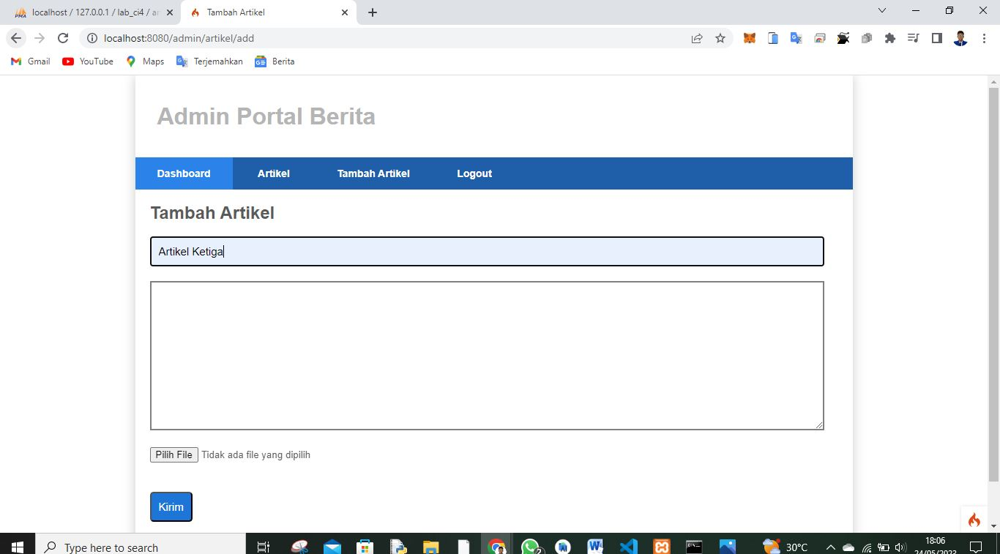
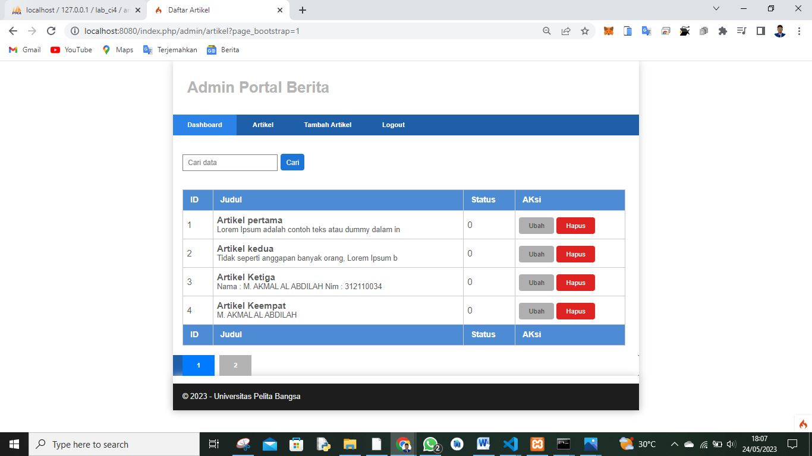
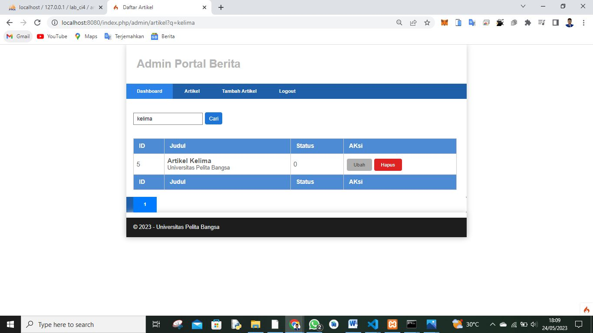
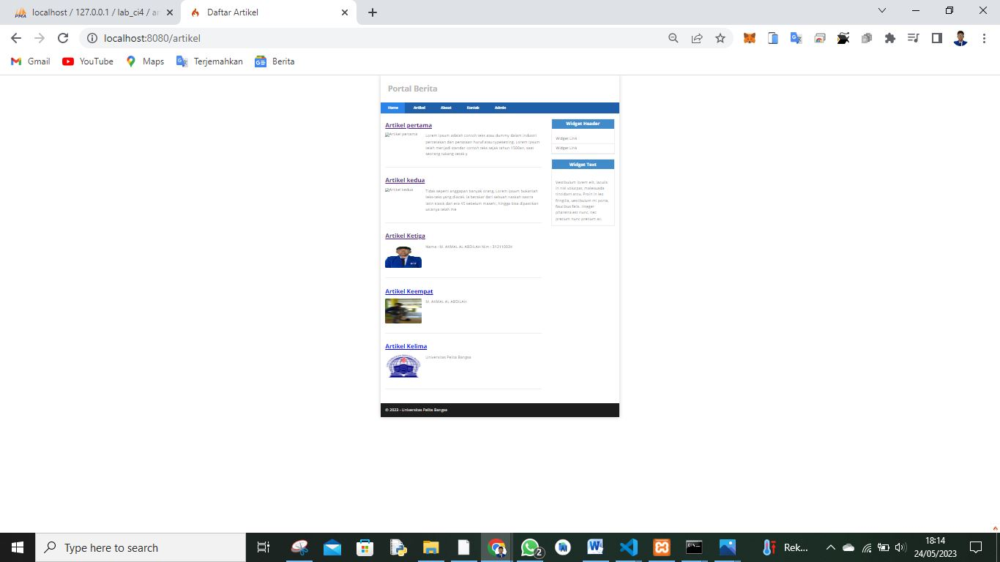

# Pemograman Web2 Pertemuan 13

## Profil
| #               | Biodata                      |
| --------------- | ---------------------------- |
| **Nama**        | M. AKMAL AL ABDILAH          |
| **NIM**         | 312110034                    |
| **Kelas**       | TI.21.A.1                    |
| **Mata Kuliah** | Pemrograman Web 2            |

 

## Praktikum 11 : Upload File Gambar

 
 **`Tambah Artikel & Upload Gambar`**
 
Saya Buat Artikel Keempat dan mengupload gambar artikel :

Gambar 10. Upload Gambar

Disini saya sudah setting untuk tampilan saya batasi 4 halaman :

Dan Selanjutnya kita buat artikel lagi dan kita buka Navigasi Halaman Ke 2 :

 **`Cari/Filter Artikel`**
 
 saya coba Cari/filter untuk Artikel Kelima :
 
 

 **`Tampilan Artikel Di portal Berita`**
 
  
  
  
  

  
  Cukup Sekian Penjelasan Dari saya
  
  **SELESAI**
  

<h2 align="center">Thanks For Reading!!!</h2>

